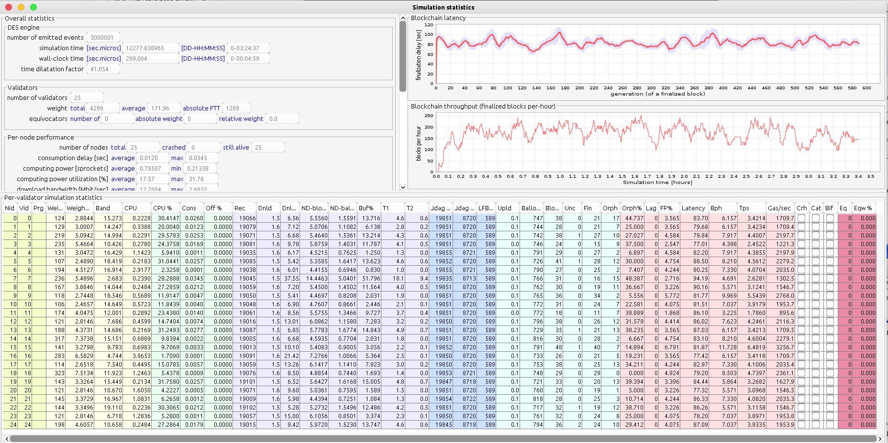
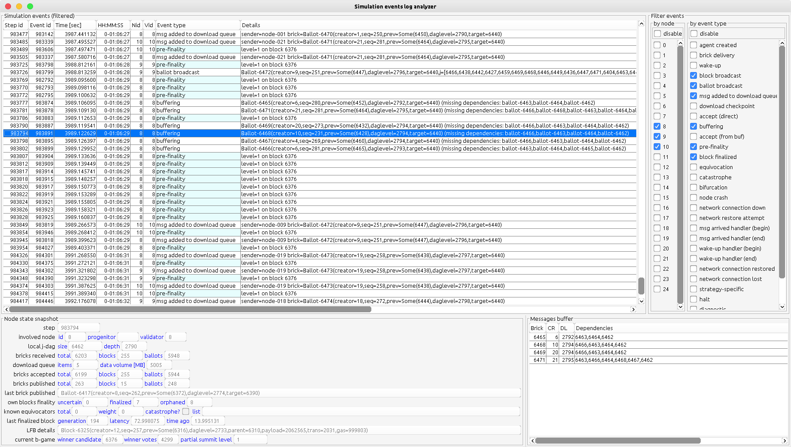

# About this project

## Introduction

**Phouka** is a simulator of a (specific variant of) proof-of-stake blockchain.

The real scope of the simulation is the consensus protocol. We abstract away from the smart contract platform in use.

We use "discrete event simulation" approach so to be able to do exact measurements of blockchain performance, independent of
the host machine performance and any implementation simplifications applied. 

## Goals

Two main use cases are expected:

- educational tool:  as a toy to play with / explain to others / understand the details of how proof-of-stake blockchains
  internally work
- research tool: as an experimentation platform for measuring performance of specific family of consensus protocols and especially
  for investigating the influence of various parameters (network structure and performance, nodes computing power, 
  malicious behaviour, node crashes, network outages etc) on the consensus performance

## Current dev status

This is work in progress now.

Beta status is not achieved yet. GUI is incomplete. Features are missing. Engine is under testing. 

(see **Development** section below for details)

## How to play with this version

As this is work in progress, there is no binary release yet. Also, the configuration subsystem is not ready yet,
and the documentation of the config file layout is not there. You will need to feel comfortable building the project
from sources. You must also feel comfortable starting the app "manually" by invoking the entry point (i.e. a class
with "main" method). Most likely you would be editing some params directly in code, so from now on I pretty much assume
you are a developer familiar with Scala ecosystem and using some IDE (like IntelliJ Idea).

The entry point to start playing with Phouka is this class:
```
com.selfdualbrain.experiments.Demo1
```

It will run a single simulation, using an example blockchain configuration that you will find hardcoded in this class.
The simulation is configured to run 25 honest validators (no malicious nodes), on a reliable network (no outages).
Network structure, individual per-node download bandwidth and per-node computing power will be randomized. All nodes will
use the same finalizer setup: fault tolerance set to 0.30, and acknowledgement level set to 3. Validators will use
"naive casper" blocks production strategy.

The simulation will stop after processing 1 million events. This should take about 90 seconds on an average laptop. You will see
a counter of processed events showing up on system console. Upon stopping, the following things will happen:

- complete simulation stats will be printed on System.out
- a window "Simulation events log analyzer" will open
- a window "Simulation statistics" will open

This is what you will see:





`Demo1` class accepts up to 3 command-line arguments:

1. Number of steps of the simulation (int value, default is 1 million steps).
2. Variant of the protocol (string value without quotes, default is ncb):
   - ncb - picks "naive casper" variant
   - sls - picks "simple leaders sequence" variant
   - lsdr - picks "leaders sequence with dynamic rounds" variant
3. Seed of the random numbers generator; if not provided here, a random seed will be created automatically.

For example your command-line arguments may look like:

```bigquery
5000000 sls 42
```

This will make the Demo1 to run for 5 million cycles, using simple leaders sequence variant of consensus and random seed 42.

You may find the contents of the GUI a little cryptic at first. When a mouse pointer stops at the header of a table, a tooltip
with short explanation will be displayed.

Feel free to adjust parameters in the Demo1 yourself (this requires editing the hardcoded config in Demo1 class). You can also
use `ReferenceExpConfig` class, which contains a handful of ready-to-use blockchain configurations.

**Remarks**

1. `Demo1` instructs the engine to use a different random seed on ever run, so each time you start a simulation, you will
see a different outcome. If needed, you can provide the seed as the second command-line parameter. It is possible to
re-run the exact same simulation by providing the random seed. This is why the random seed is printed on System.out at the
beginning of the simulation. In case of bug reports, the experiment configuration and the seed are needed to replicate the problem.

2. The simulator will push your CPU to the limits. Always ensure your computer has optimal cooling conditions before
running the simulator, as it may easily overheat your computer.

3. The currently available GUI is just a teaser. Do not consider it as an approximation of final user interface.

4. On the latency chart, the red curve is surrounded with mysterious blue ribbon. The red curve represents the average value,
   while the blue ribbon represents standard deviation.

## Explanation of the "Phouka" name.

Phouka is a (rather weird) creature one can find in Celtic folklore. It is something between a cat, a rabbit, 
a goat and a fairy. It is shocking at first glance and ... just different from whatever you expected.
Nevertheless, over time you may find you like it.

See [here](https://en.wikipedia.org/wiki/P%C3%BAca).


# Features (in a nutshell)

_Caution: info below is REALLY concise. Users's Manual will cover the description of the protocol in
great detail. Stay tuned._

## Blockchain consensus model

The consensus theory used in Phouka is a variant of proof-of-stake building on a directed graph of blocks and votes (aka "ballots").
The formal descritpion of the theory is under construction.

Please be warned that the current version of Phouka implements only a sub-protocol of the desired "blockchain consensus" solution:

- the set of validators is fixed (= no eras, no validator rotation)
- spam protection aka "endorsements" is not implemented

Support for the complete blockchain protocol is planned in Phouka ver 2.0 (see "Dev roadmap" section below).

Phouka is thought as a platform for playing with a wide collection of protocol variants, especially in the area of block production
strategies. Validator implementations are pluggable. Currently, 3 validator  strategies are implemented:

- NCB (Naive Casper Blockchain) - where blocks and ballots are produced randomly, at predefined average frequency
- SLS (Simple leaders sequence) - round based with fixed round length and pseudo-random leaders sequence;
  only the leader of a round publishes a block, while others produce ballots
- LSDR (Leaders sequence with dynamic rounds) - round-based, with round lengths based on powers-of-two principle; every node picks
  own round exponent and round exponent auto-adjustment algorithm is applied

## Network model

What may be especially interesting from the point of view of research is that the simulation is not only about the
"happy path" of consensus. Actually much of the implementation effort is put into simulation of "bad things" that
interfere with consensus:

- malicious nodes (aka "equivocators")
- network failures
- node crashes

Currently, we implement only the "cloning" model of equivocators, so a situation when a validator node "splits" into
N identical, independent validator nodes, which are not "aware" they are part of split (something like this may happen
in real life when a master-slave failover configuration fails, and the slave node - using same credentials as the
master - joins the blockchain network, using the most up-to-date state snapshot of master).

The network model covers:

- network topology and delays
- per-node download bandwidth
- network outages
- node crashing

To achieve meaningful statistics, we distinguish the binary size of messages in the simulated protocol form
the binary size of messages used in the actual implementation of Phouka. So for example one can configure the header binary size,
validator id binary size and so on to correctly reflect characteristics of a real system to be simulated.

## Nodes model

Thanks to DES we have the exact simulation of real-time (with microsecond resolution), hence can simulate computing power
of nodes that form the blockchain network. To unify this with blockchain transactions processing model we
use the following units:

- gas - is the unit of on-chain transactions processing cost
- gas/second - is the unit for defining performance of a node
- sprocket = 1 million gas/sec

We simulate nodes as if they were sequential computers (1 processor, single core). For every node its
computing power defined in sprockets is configurable.

A node can become crashed. After a crash, a node is deaf (does not react to incoming messages and also
does not produce any new messages).

# Development

## Tech stack

- The development language is Scala.
- The GUI is based on Java Swing.
- The simulation runs totally in RAM (there is no external storage support yet), so it is OutOfMemory exception
  which eventually blows the sim. For reasonably-sized simulations assume that 32 GB of RAM is a good starting point,
  while 16 GB is the absolute minimum.
- DES is implemented in a classic way (priority queue of events), so we do not utilize parallelism. This is for
  a good reason: parallel-DES impacts the complexity of any simulator a lot. Nevertheless, parallel-DES is
  considered as nice-to-have(see the section "Dev roadmap" below).
- The coding style is a proper mix of OO and FP, with OO quite dominating. Partially because we liked it this way, but also
  in many cases this is caused by explicit performance optimizations.
  
Caution: tested on Oracle JDK 11.0.8

## Current status

COMPLETED:

- DES simulation core engine
- network model
- blockchain simulation engine
- NCB model
- SLS validator
- LSDR validator
- statistics processor
- simulation recording
- GUI - mvp framework on top of Java Swing
- GUI - events log browser
- GUI - node stats browser

IN PROGRESS:

- config serialization / deserialization
- experiments framework
- engine testing / profiling
- GUI - projects manager
- GUI - experiment runner
- GUI - brickdag graph
- binary release
- user's manual


## Dev roadmap

Milestones achieved:
- 2020-05-14: project kick-off
- 2021-02-15: demo-1: hardcoded experiments config, limited log analyzer, limited stats
- 2021-03-10: demo-2: demo-1 + stats GUI + engine performance (radically) improved
- 2021-03-15: demo-3: demo-2 + log analyzer GUI

Planned milestones:
- beta-1: demo-3 + experiments config GUI + j-dag graph + sim data export + binary release
- beta-2: bugfixes/polishing
- release of ver 1.0 + user's manual

Changes expected in ver 2.0:
- full consensus protocol support (endorsements/spam protection, eras with slots, validators rotation)
- realistic blockchain P2P network model (explicit implementation RPC-over-DES, gossip protocol over RPC, Kademlia-based discovery)

# Licensing and forking
This software is covered by GPLv3 license. The text of the license is included in `license.md` file.
In case the GPLv3 licensing model does not fit your purpose, please contact me directly.

I am generally happy for anyone to use Phouka "as is". I am also happy if someone includes Phouka as part of
another GPLv3 project. Everyone is welcome to use Phouka in the context of blockchain research or for  doing blockchain-related
presentations. I will be definitely happy when Phouka will contribute to the blockchain revolution  we are currently witnessing
around the world. Also, if you want to include Phouka as part of some in-house project (so, not distributed), you are free to do so.

For including Phouka in another software, which will be distributed under other name, regardless it
being open source or proprietary, I may or may not be happy depending on a concrete situation, so please
contact me to clarify.
